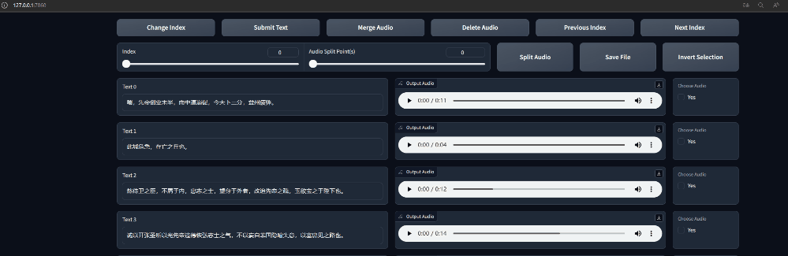
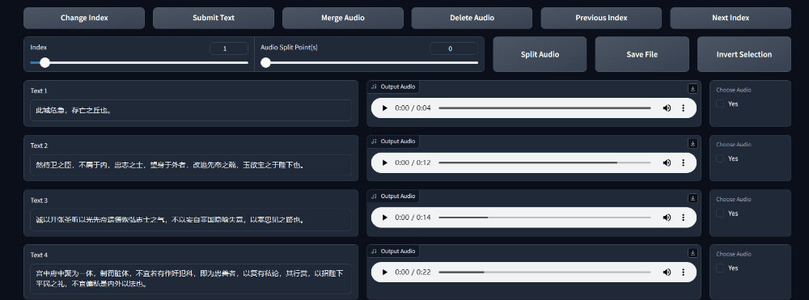
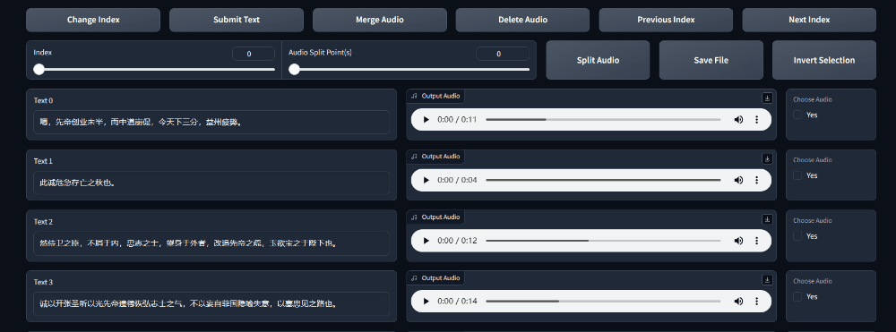
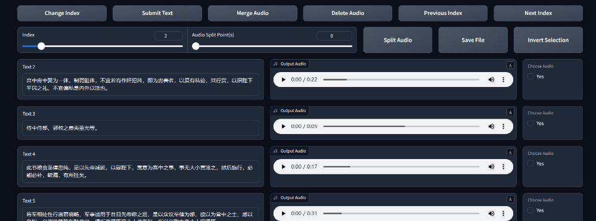
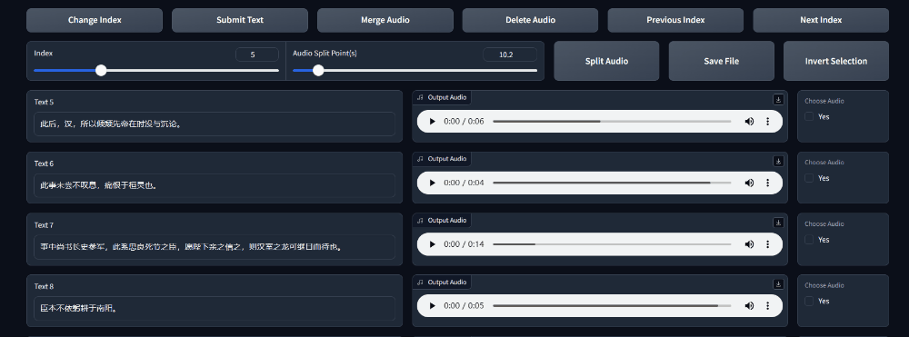

# SubFix
`SubFix`是一个用于轻松地编辑修改音频字幕的网页工具。能够实时地看到改动，方便地对音频进行**合并、分割、删除、编辑字幕**。

`SubFix`同时也支持自动化语音标注，使用`modelscope`和`whisper`对文本进行多语言标注。目前`modelscope`支持中文、英语、日语、德语、德语、俄语的自动化标注。`whisper`支持几乎所有语言。

[English Version](README.md)

旧版独立文件可以访问[Release V1.2](https://github.com/cronrpc/SubFix/releases/tag/v1.2)获取。

## 安装

进行如下安装步骤可以快速而轻松的安装。建议使用`Linux`环境。如果是`Windows`环境，需要您手动配置`ffmpeg`环境变量，并且`modelscope`的安装可能比较复杂。

### 安装依赖

确认安装的`Python`版本最好大于`3.9`，然后执行如下命令。如果您不需要使用音频的自动标注，那么不需要安装`Modelscope`模块。

使用conda
```bash
conda create -n modelscope python=3.9
conda activate modelscope
```

安装依赖

```bash
sudo apt install build-essential
sudo apt install ffmpeg

git clone https://github.com/cronrpc/SubFix.git
cd SubFix
pip install "modelscope[audio]" -f https://modelscope.oss-cn-beijing.aliyuncs.com/releases/repo.html
pip install -e .
```

## 使用指南

当你使用`pip install -e .`安装后，在`shell`下可以通过该命令在任意目录下启动本工具。所有参数都有默认值，如果是默认值的话，不需要输入任何`--option`。
```bash
subfix -h

# webui
subfix webui -h
subfix webui --load_list demo.list --webui_language zh --force_delete True
# create dataset
subfix create modelscope -h
# 英语
subfix create modelscope --source_dir origin --language EN
# 中文
subfix create modelscope --source_dir origin --language ZH
# 日语
subfix create modelscope --source_dir origin --language JA
# Openai-Whisper标注 (几乎支持所有语言)
subfix create whisper --source_dir origin --language ZH
subfix create whisper --source_dir origin --language JA
# 说话人确认 （分离不同说话人）
subfix diarization -h
subfix diarization --source_dir origin --target_dir diarization --min_seconds 3.0
```

每次使用自动标注前，建议清空一下`cache/subfix/`文件夹
```bash
rm -rf cache/subfix
```

## 启动SubFix查看数据集

`SubFix`支持2种格式，分别是`.json`和`.list`格式。

`.list`的格式中，每行数据类似于`"{wav_path}|{speaker_name}|{language}|{text}"`。

例如，如果你已经有了一个`demo.list`文件，和它对应的音频已经放到了正确的路径，那么可以执行如下命令来启动`SubFix`的UI界面：

```bash
subfix webui --load_list demo.list
# or
subfix webui --load_json demo.json
```

查看帮助
```bash
subfix --help
subfix webui --help
```

### 快速查看和听取音频

可以点击`Previous Index`、`Next Index`按钮来切换列表，同时可以拖动`slider`并点击`Change Index`来快速定位列表。



### 修改文本

可以直接修改文本，并点击`Submit Text`按钮来保存修改。



### 合并

选择需要合并的音频，设置`合并间隔`，然后点击`合并`按钮来合并音频。



### 分割音频

选择需要分割的音频，设置`分割点`，然后点击`分割`按钮来进行分割。注意，一次只能分割一个音频，分割后需要重新调整下文本。



### 删除

选择需要删除的音频，点击`按钮`进行删除。删除操作将暂存到内存之中，如果需要保存到文件中，需要点击保存按钮，或者执行一次其他命令来保存。



### 自动标注音频和创建数据集

默认情况下，将音频文件放入`origin`文件夹下，对于一个`sam`音频文件`abc.wav`，其所在的文件路径可以是`./origin/sam/abc.wav`这样的结构，之后执行下面的命令：

```bash
# rm -rf cache/subfix
subfix create --source_dir origin --output demo.list
```

该命令将创建一个`dataset`目录，同时将所有文件转录的音频的路径和字幕存储到了`demo.list`文件中。

### 说话人识别、聚类

在某些情况下，大段落音频中由于存在背景音乐，会将背景歌曲的人声或噪音识别，造成同一文件中的多人说话。

又或者，说话太过密集，导致识别出来的音频过长。

该功能将提取出每个文件中出现次数最多的`n`个说话人，说话人的每句话之间间隔`interval`秒，保存在`diarization`文件夹中，便于后续提取音频。

```bash
subfix diarization --source_dir origin --target_dir diarization --min_seconds 3.0 --interval 10 --top_of_number 1
subfix create modelscope --source_dir diarization --language ZH
```

## 格式转换

两种格式`.list`和`.json`可以互相转换，使用如下命令对文件进行转换：

```bash
subfix format_convert --source demo.list --target demo.json
subfix format_convert --source demo.json --target demo.list
```

## References

- [anyvoiceai/MassTTS](https://github.com/anyvoiceai/MassTTS)
- [fishaudio/Bert-VITS2](https://github.com/fishaudio/Bert-VITS2)
- [openai/whisper](https://github.com/openai/whisper)